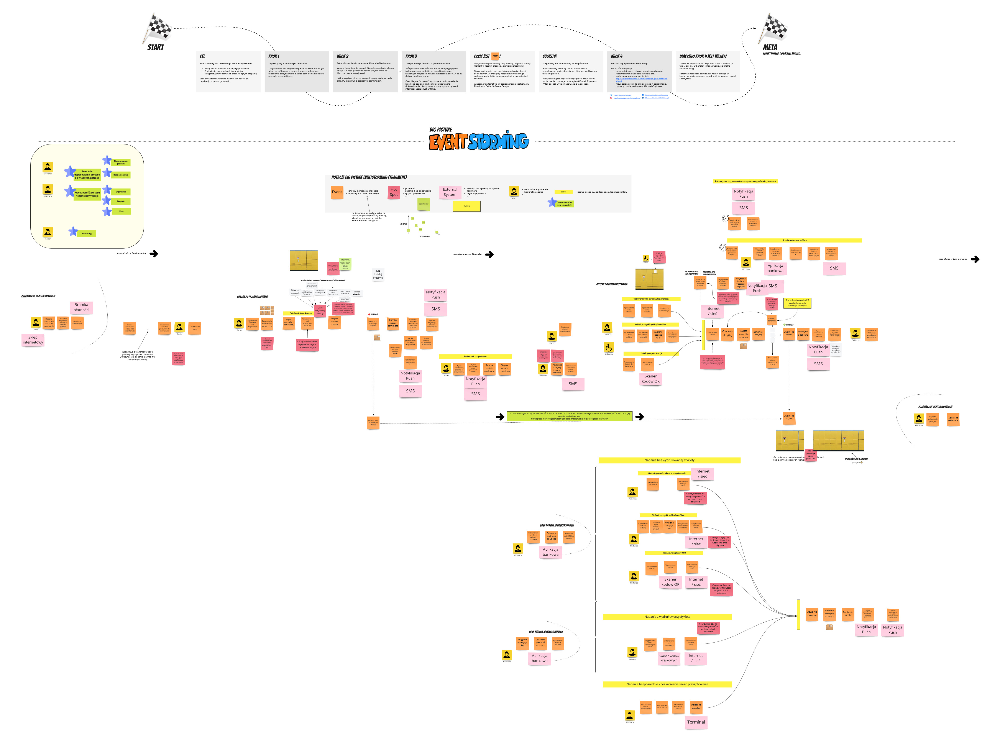

:toc:
:toc-placement!:
:linkattrs:

toc::[]

= Intro

The project is an attempt to discover,model and implement the parcel distribution processes (by using parcel machines).

Its main purpose is to learn some aspects Domain Drive Design.

* https://explorers.bettersoftwaredesign.pl/repositories.html[Repositories]

|===
|Domain Driven Design - this is an attempt to understand the language and implement it in code .

|
 _nice, isn't it ?_
|===

= Domain Description

A detailed domain description can be found in the video materials on https://explorers.bettersoftwaredesign.pl/[the main page of the project].

= Domain Exploration

== Big Picture

The main goal of Big Picture Event Storming is to discover and model the main processes taking place in the domain.
Problem should be divide into smaller business parts, that can be analyzed independently.

https://miro.com/app/board/o9J_lV31ycs=/[Miro board]

link:domain/img/domainexplorers-es-bigpicture-1.jpg[Show picture^,window=_blank]

